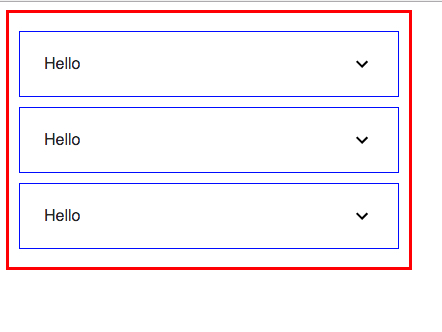

JavaScript React Material UI Disable Dynamic ClassName Demo
===========================================================

注意：在material-ui 4.0的时候，已经是默认生成全局不变的className了，所以这个Demo中的做法已经不需要了。

----

Material-ui内部使用了jss，导致它生成的class name是动态的，比如`MuiList-root-2`，
使得我们难以通过普通的css来设置样式，而必须使用jss以javascript的形式来定义。

虽然Material-ui这么做有它自己的考虑（比如保证不同组件样式的完全独立、更自由的重定义样式、换肤等），
但是对于我们来说，有时候用不上这些优点，反而要放弃自己熟悉的工具，浪费大量时间在理解其代码结构与原理上，
每一次看效果还需要编译重载才能确定最终结果。

所以我希望能禁用其“动态生成className”的功能，这样可以让我们继续以patch的方式简单粗暴的对样式进行修改。

需要注意以下几点：

1. 我们需要在组件外面套一个`<JssProvider>`，提供自定义的`generateClassName`参数，
主要就是将`dangerouslyUseGlobalCSS`设为`true`。
这样的话，生成的ClassName就是固定的，比如`MuiList-root`，而不是再是`MuiList-root-2`。

2. 对于React component，不再需要使用`withStyles`等函数再包装一次，不需要再传入`classes`，
在tag attribute中也不需要使用`classes`，直接在`className`处写死某个我们需要的class name即可

3. 在声明样式的时候，我们可以直接使用我们自己的className声明。
但有时候因为material-ui会把它的className插入进来，导致我们的定义被覆盖。
这时候我们可以将我们声明的名字作为一种记号，与material-ui生成的className结合起来定义。比如：

   ```
   .MuiList-root.MyListItem {
     border: 1px solid blue;
     margin: 10px;
   }
   ```

   其中的`.MuiList-root`是material-ui生成的，`MyListItem`是我们定义的，我们可以用`MyListItem`去限制`MuiList-root`。

4. 为了防止不同的组件之间的样式互相干扰，我们可以：
   1. 给每个组件一个unique的id或者名称`project-component-variable`
   2. 定义属性时，使用nested

后面几点其实跟material-ui无关，我们在普通的前端项目中一般都有类似的方案。


运行Demo
------

```
npm install
npm run dev
```

It will open the index page automatically.


